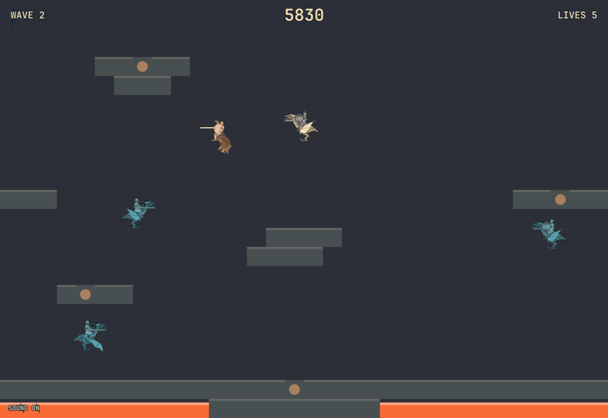

# Ostrich Riders

A theme-aware Joust-like game as a native [Omarchy](https://omarchy.org/)
shell plugin.

It runs inside the long-lived `omarchy-shell` Quickshell process. Click
the bar icon (or bind a key) to open a fullscreen overlay. Stay above
your opponent, collect the eggs before they hatch, and do not fall in
the lava.



Sprites and sounds come from [Ostrich Riders](https://github.com/dulsi/ostrichriders)
(GPL-3.0-or-later). They are stored as grayscale sheets and colorized at
runtime from the shell's `Color` singleton, so the riders follow whatever
Omarchy theme you are on. Platforms and lava are drawn the same way.

## Install

```sh
omarchy plugin add https://github.com/TomFaulkner/ostrich-riders.git --enable
```

From this checkout:

```sh
ln -sfn "$PWD" ~/.config/omarchy/plugins/TomFaulkner.ostrich-riders
omarchy plugin validate ~/.config/omarchy/plugins/TomFaulkner.ostrich-riders
omarchy plugin enable TomFaulkner.ostrich-riders --section right
```

Then click the horse in the bar, or:

```sh
omarchy-shell shell toggle TomFaulkner.ostrich-riders
```

A keybind, if you want one, in `~/.config/hypr/bindings.lua`:

```lua
o.bind("SUPER + CTRL + J", "Ostrich Riders", "omarchy-shell shell toggle TomFaulkner.ostrich-riders")
```

## Controls

- Left / Right, `A`/`D`, or `H`/`L`: move
- Space, `W`, or Up: flap
- `P`: pause
- `M`: mute
- Esc: close

## Remove

```sh
omarchy plugin disable TomFaulkner.ostrich-riders
omarchy plugin remove TomFaulkner.ostrich-riders --yes
```

High scores live in
`${XDG_STATE_HOME:-~/.local/state}/ostrich-riders/state.json`
and are not deleted with the plugin.

## Development

```
manifest.json      kinds, entry points, bar widget metadata
Game.js            physics and rules (no QML types)
Levels.js          Ostrich Riders standard maps, converted
OstrichRiders.qml  overlay
JousterSprite.qml  grayscale sheet + MultiEffect tint
BarWidget.qml      bar icon
assets/            grayscale sprites and original WAVs
test/              node tests for the rules
```

```sh
node --test
omarchy plugin validate .
```

Plugin QML is cached; after editing QML run `omarchy restart shell`.

## License

GPL-3.0-or-later. See [LICENSE](LICENSE) and [NOTICE.md](NOTICE.md).
